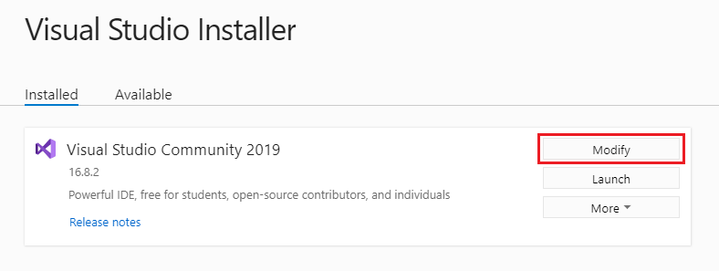
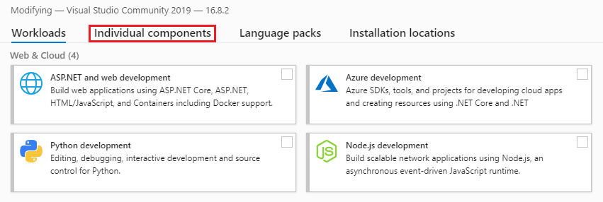
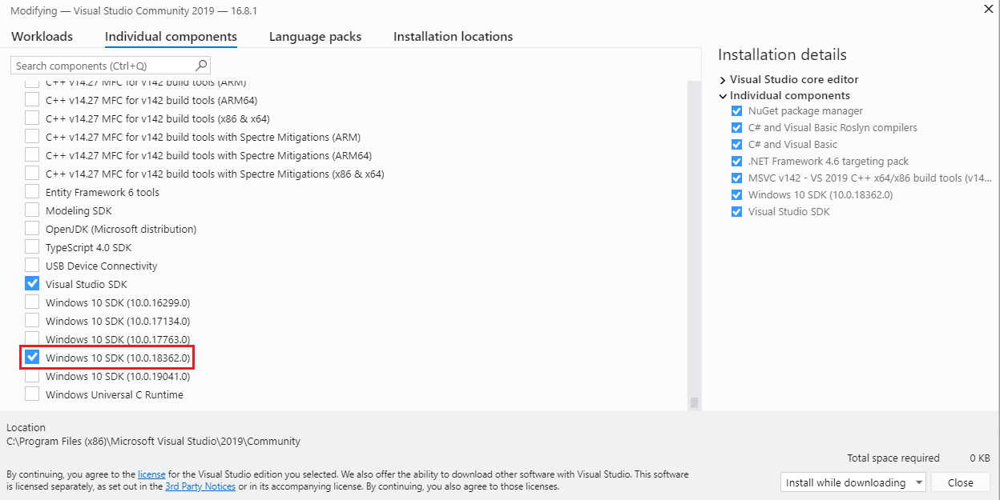
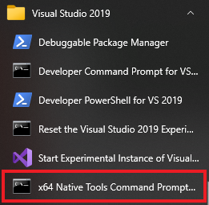

---
# Feel free to add content and custom Front Matter to this file.
# To modify the layout, see https://jekyllrb.com/docs/themes/#overriding-theme-defaults

layout: page
---

<h2>GraalVM Native Image on Windows 10</h2>
<h3>Steps for Installation and Running Basic Demos</h3>  
<hr />
<br />

1. Install the Windows SDK Using Chocolatey:

	C:\\\> **choco install -y windows-sdk-10 kb2919442**

	or 

4. Install the Windows SDK Using Visual Studio Code
5. Install Visual Studio 2019 16.8.x (Community will work)

6. Open the Visual Studio Installer

    


7. Under the ‘**Installed**’ tab, click on the ‘**Modify**’ button and choose ‘**Individual Components**’
  
  
    
11. Scroll to the bottom and make certain ‘**Windows 10 SDK**’ is installed

    
  
13. Follow the [GraalVM install instructions for Windows](https://docs.oracle.com/en/graalvm/enterprise/20/docs/getting-started/installation-windows/)

15. Verify the GraalVM install

     C:\\\> **java -version**

     ```
     java version "11.0.9" 2020-10-20 LTS
     Java(TM) SE Runtime Environment GraalVM EE 20.3.0 (build 11.0.9+7-LTS-jvmci-20.3-b06)
     Java HotSpot(TM) 64-Bit Server VM GraalVM EE 20.3.0 (build 11.0.9+7-LTS-jvmci-20.3-b06, mixed mode, sharing)
     ```

23.    [Download the native-image module](https://www.oracle.com/downloads/graalvm-downloads.html#license-lightbox)


26. Install the native-image module

     C:\\\> **gu -L install .\native-image-installable-svm-svmee-java11-windows-amd64-20.3.0.jar**	


32. Check for installed modules

    C:\\\> **gu list**
    ```
    ComponentId             Version             Component name      Origin
      ------------------------------------------------------------------------
      js                      20.3.0              Graal.js
      graalvm                 20.3.0              GraalVM Core
      native-image            20.3.0              Native Image
    ```


50. Open a Windows command prompt to start a Visual Studio Dev session:


     C:\\\> **"C:\Program Files (x86)\Microsoft Visual Studio\2019\Community\Common7\Tools\vsdevcmd" -arch=amd64**
      ```
      ******************************************************************
      Visual Studio 2019 Developer Command Prompt v16.8.1
      Copyright (c) 2020 Microsoft Corporation
      ******************************************************************
      ```


64. Or launch a Dev command prompt (via Visual Studio 2019):

	


66. Create a basic application called `HelloWorld.java`:

     ```java
     public class HelloWorld {
       public static void main(String[] args) {
         System.out.println("Hello, GraalVM Native Image!");
       }
     }
    ```


67. Compile
  
	C:\\\> **javac HelloWorld**


82. Create a Native Image

    C:\\\> **native-image HelloWorld**

      ```
     [helloworld:10284]    classlist:     956.55 ms,  0.96 GB
     [helloworld:10284]        (cap):   2,525.43 ms,  0.96 GB
     [helloworld:10284]        setup:   4,266.09 ms,  0.96 GB
     [helloworld:10284]     (clinit):     125.53 ms,  1.19 GB
     [helloworld:10284]   (typeflow):   3,513.99 ms,  1.19 GB
     [helloworld:10284]    (objects):   3,226.40 ms,  1.19 GB
     [helloworld:10284]   (features):     159.53 ms,  1.19 GB
     [helloworld:10284]     analysis:   7,136.97 ms,  1.19 GB
     [helloworld:10284]     universe:     249.78 ms,  1.19 GB
     [helloworld:10284]      (parse):     593.14 ms,  1.67 GB
     [helloworld:10284]     (inline):     818.67 ms,  1.67 GB
     [helloworld:10284]    (compile):   7,087.49 ms,  3.19 GB
     [helloworld:10284]      compile:   8,959.29 ms,  3.19 GB
     [helloworld:10284]        image:     742.99 ms,  3.19 GB
     [helloworld:10284]        write:     236.82 ms,  3.19 GB
     [helloworld:10284]      [total]:  22,670.83 ms,  3.19 GB
     ```


107. Run the Native Image version


     C:\\\> **helloworld**      
    _Hello, GraalVM Native Image!_


116. Measure Startup Time (_using PowerShell_):

      C:\\\> **Measure-Command {".\helloworld"}**
    
      ```
      Days              : 0
      Hours             : 0
      Minutes           : 0
      Seconds           : 0
      Milliseconds      : 3
      Ticks             : 38000
      TotalDays         : 4.39814814814815E-08
      TotalHours        : 1.05555555555556E-06
      TotalMinutes      : 6.33333333333333E-05
      TotalSeconds      : 0.0038
      TotalMilliseconds : 3.8
      ```
    
	

	
	
<h3>Micronaut Example</h3>
<hr />
Install Micronaut using Chocolatey:

C:\\\> **choco install -y micronaut**

or

Install using instructions [here](https://micronaut-projects.github.io/micronaut-starter/latest/guide/index.html#installWindows). 


Follow the Micronaut/GraalVM tutorial [here](https://guides.micronaut.io/micronaut-creating-first-graal-app/guide/index.html).
  


<h3>Polyglot Example</h3>
<hr />

1. Create a file called `PrettyPrintJSON.java`: 


 ```java
 import java.io.*;
 import java.util.stream.*;
 import org.graalvm.polyglot.*;

 public class PrettyPrintJSON {
   public static void main(String[] args) throws java.io.IOException {
     BufferedReader reader = new BufferedReader(new InputStreamReader(System.in));
     String input = reader.lines()
     .collect(Collectors.joining(System.lineSeparator()));
     try (Context context = Context.create("js")) {
       Value parse = context.eval("js", "JSON.parse");
       Value stringify = context.eval("js", "JSON.stringify");
       Value result = stringify.execute(parse.execute(input), null, 2);
       System.out.println(result.asString());
      }
     }
 }
 ```
23. Compile the code:

	C:\\\> **javac PrettyPrintJSON.java**

25. Create a Native Image:

	C:\\\> **native-image --language:js --initialize-at-build-time PrettyPrintJSON**


30. With Windows, when you are ready to complete the input, press the `Enter` key and then press `Ctrl+Z` and then `Enter` again to complete the input _(see below)_.


34. Run the application:

	C:\\\> **prettyprintjson**

	```
	{"GraalVM":{"description":"Language Abstraction Platform","supports":["combining languages","embedding languages","creating native images"],"languages": 	["Java","JavaScript","Node.js", "Python", "Ruby","R","LLVM"]}} 
	<enter> CTRL-Z <enter>
	```
```json
{
     "GraalVM": {
      "description": "Language Abstraction Platform",
       "supports": [
         "combining languages",
         "embedding languages",
         "creating native images"
      ],
       "languages": [
          "Java",
          "JavaScript",
          "Node.js",
          "Python",
          "Ruby",
          "R",
          "LLVM"
       ]
      }
    }
```